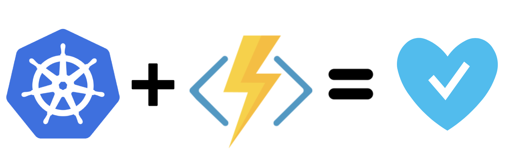
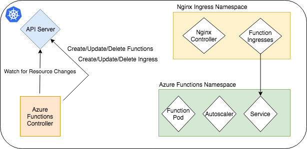

# Azure Functions for Kubernetes



----

Azure Functions for Kubernetes allows developers to deploy, scale and manage Azure Functions on Kubernetes by treating functions as native Kubernetes components.

With Azure Functions for Kubernetes developers get the same PaaS like experience in regards to load balancing, auto scaling and deployment.

[](https://asciinema.org/a/195460)

----

## About

Azure Functions for Kubernetes uses a CustomResourceDefinition to describe Azure Functions and a custom controller that watches for new resources and acts accordingly to reconcile the desired state and the needed Kubernetes primitive resources required.



## Features

* Configurable Network Access Policy - Private/Public Functions
* Min/Max Instances
* Autoscaling
* Namespace isolation
* Ingress support - Configurable
* On-The-Fly Route Changes
* Mesh Support - Configurable

## Prerequisites

* Standard Kubernetes Cluster (1.8+)

## Networking

Azure Functions will automatically install an Nginx Ingress Controller by default and handle routing dynamically for every new function or changes to existing functions.

Although recommended, Ingress support is optional and can be disabled - resulting in having a Public IP per function if configured for public access.

*Note: Private network access policy is disabled when using Ingress*


## Getting Started

### Setup Azure Functions for Kubernetes

Create the Azure Functions CRD:

```
$ kubectl create -f ./deploy/azurefunctions-crd.yaml
```

Run Azure Functions Controller:

```
$ kubectl create -f ./deploy/azurefunctions-controller.yaml
```

Wait for the Azure Functions Controller Pod to be in Running state.
You can check for the status with:

```
$ kubectl get pod azurefunctions-controller -n azure-functions
```

All done!

### Run an Azure Function

First, make sure the [Azure Functions CLI](https://docs.microsoft.com/en-us/azure/azure-functions/functions-run-local#install-the-azure-functions-core-tools) is installed.

Example AzureFunction object template:

```
apiVersion: dev.azure.com/v1
kind: AzureFunction
metadata:
  name: test-func
spec:
  accessPolicy: public
  min: 1
  max: 100
  image: microsoft/azure-functions-runtime:2.0.0-jessie
  ingressRoute: "/test"
```

#### Deploying Manually

Create a Docker Image with the Azure Functions Runtime:

```
$ func init --docker
```

Create a function:

```
$ func new -n myfunc -l JavaScript
```

Build the Docker Image:

```
$ docker built -t <repository/image> .
```

Push the Docker Image:

```
$ docker push repository/image
```

Change the image in the AzureFunction template to your image, and deploy the function:

```
$ kubectl apply -f ./examples/azfunc.yaml
```

#### Deploying with the Azure Functions CLI

Create a Docker Image with the Azure Functions Runtime:

```
$ func init --docker
```

Create a function:

```
$ func new -n myfunc -l JavaScript
```

Deploy:

```
$ func deploy --platform kubernetes --name myfunction --registry <docker-hub-id or registry-server>
```


#### List all Azure Functions

```
$ kubectl get azurefunctions
```

#### Find the URL of a function

```
$ kubectl get azurefunction <function-name> -o jsonpath='{.spec.URL}'
```


#### Controller Startup options

The Azure Functions controller can be configured to install Ingress components and different Service Mesh implementations via Environment Variables.

Currently supported Ingress Controllers:

* Nginx

Currently supported Meshes:

* Istio

In order to disable Ingress, simply remove the INGRESS Environment Variable from the Deployment section at deploy/azurefunctions-controller.yaml.
To have the controller automatically setup Istio with automatic side car injection, set a MESH Environment Variable with the value of "ISTIO".


## Development

Prepare the go binary:

```
$ ./build.sh
```

Build the Docker image:

```
docker build -t <your-repo> .
```

## Roadmap

* Custom Scale Controller - scale based on Trigger type
* Implement [Linkerd 2.0 (Ex-Conduit)](https://github.com/linkerd/linkerd) Service Mesh support
* Implement [Traefik](https://traefik.io/) Ingress support 
